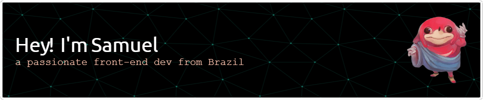

<h1 align="center"></h1>
<h3 align="center">A passionate frontend developer from Brazil</h3>
   

- 😎 Currently deep diving in Next.js and Node.JS
  

  
| **Connect with me**  |
|:---:|
| 
  
 |
  
|  **Languages and Tools** |
|:---:|
|  
      
|

<!--GIT STATUS-->

 

